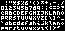

# Bytesized

[Now on Google Fonts!](https://fonts.google.com/specimen/Bytesized)

Bytesized is a miniscule monospace pixel font - 3x4 modulo diacritics - 
made to be as legible as possible within these restrictions.

The name comes from the fact that, if you restrict the font to ASCII only,
you can store it raw in just under 150 bytes!

While a few compromises had to be made to fit it into such a small profile,
namely only supporting the Latin Core character set,
and some "creative" glyph designs, so to speak,
it's still quite readable!

# Building

Bytesized is created dynamically from multiple images found in `scripts/glyphs`.

To set up for building and testing, run `make setup`.

In order to build the font, run `make generate build` at the root of the project. 
This will create the UFO, and then from that the TTF, and put it in `fonts/ttf/Bytesized-Regular.ttf`.

If you want to run any tests or create a proof, `make test` and `make proof` exist for those.

For short, you can run `make generate build test` if you're working on the font.

# Contribution

Contributions are welcome! Feel free to open a PR with any changes you may want to make. Make sure to add yourself to `CONTRIBUTORS.txt`.

**DO NOT edit the .ufo file in the `sources` directory! It will be overwritten.** Instead, do this:

1. Draw the new glyph in `scripts/glyphs/<name>.png`, where `<name>` can be anything you like
   
   Each glyph must have an image size of 3 wide by 10 tall,
   but it's strongly recommended to keep it within 4 pixels tall - 
   each image has 4 pixels for top diacritics,
   4 pixels for the actual glyph, and 2 for bottom diacritics.

   If at all possible, the regular bounding box should only be broken for diacritics.

2. Add the metadata to `scripts/glyphs.toml`

   Each entry in this file has:
   - A name, dictating its glyph name in the font - this is the text between `['` and `']`
   - A list of Unicode codepoints that it represents - this is the `codepoints` field
   - A path to the image that the glyph shows - this is the `image` field, relative to `scripts/glyphs/`

# Changelog

## v1.000
- Initial release

## v1.001
- Properly handle dotless i/j

## v1.010
- Add Ŭ/ŭ

## v1.011
- Change file layout of repository, no glyphs have changed

## v1.100
- Alter a few glyphs to have better kerning between letters and unique glyphs where needed

## v2.000
- Swap `O` and `0`, adjust `o` to match
- Separate all diacritics from their letters visually
- Move around two-wide characters to be consistent

## v2.100
- Add braille symbols and some math symbols

# Acknowledgements

The code for generating a vector image from a pixel graphic uses an algorithm created by _yellowafterlife_,
which can be found [here](https://yal.cc/grid-based-contour-traversal/).

# License 

This Font Software is licensed under the SIL Open Font License, Version 1.1. This license is in this repo OFL.txt and is also available with a FAQ at: https://scripts.sil.org/OFL.

Thanks for reading &lt;3 -baltdev

