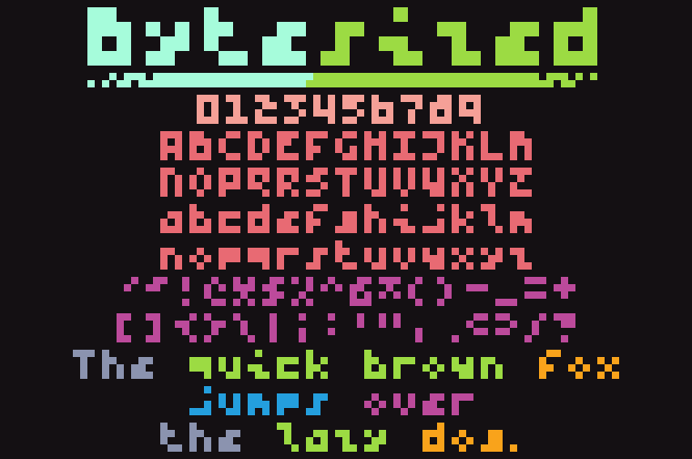

# Bytesized

Bytesized is a miniscule monospace pixel font - 3x4 modulo diacritics - 
made to be as legible as possible within these restrictions.

The name comes from the fact that, if you restrict the font to ASCII only,
you can store it raw in just under 150 bytes!

While a few compromises had to be made to fit it into such a small profile,
namely only supporting the Latin Core character set,
and some "creative" glyph designs, so to speak,
it's still quite readable!

# Building

Bytesized is created dynamically from a spritesheet found in `sources/spritesheet.png`.

To set up for building and testing, run `make setup`.

In order to build the font, run `make build` at the root of the project. 
This will create the TTF, and put it in `fonts/Bytesized-Regular.ttf`.

If you want to run any tests or create a proof, `make test` and `make proof` exist for those.

# Contribution

Contributions are welcome! Feel free to open a PR with any changes you may want to make. Make sure to add yourself to `CONTRIBUTORS.txt`.

To add a new glyph, you need to do three things:

1. Draw the new glyph in the spritesheet in `spritesheet.png`.
   
   Each glyph has a bounding box of 3 wide by 10 tall, with 1 pixel of padding on each side,
   but it's strongly recommended to keep it within 4 pixels tall - the box has 4 pixels for top diacritics,
   4 pixels for the actual glyph, and 2 for bottom diacritics.

   If at all possible, the regular bounding box should only be broken for diacritics.

2. Add a glyph name to glyphnames.txt
   
   This name doesn't _have_ to match up with the glyph's canonical name, but it probably should.

3. Add the glyph's Unicode codepoint to a new line in glyphset.txt
   
   Each line in this file contains `U+`, then a hexadecimal string dictating the Unicode codepoint the glyph represents.

# Changelog

## v1.000
- Initial release

## v1.001
- Properly handle dotless i/j

## v1.010
- Add Ŭ/ŭ

# Trivia

If you trim the font down to only 96 ASCII characters (0x20 through 0x7F), you can store each glyph in only 3x4 = 12 bits, 
meaning you can store the entire font in only 144 bytes! You can see exactly that in `./spritesheet-raw.bin`.
In said file, each glyph is stored one after another in row-major order.

# Acknowledgements

The code for generating a vector image from a pixel graphic uses an algorithm created by _yellowafterlife_,
which can be found [here](https://yal.cc/grid-based-contour-traversal/).

# License 

This Font Software is licensed under the SIL Open Font License, Version 1.1. This license is in this repo OFL.txt and is also available with a FAQ at: https://scripts.sil.org/OFL.

Thanks for reading &lt;3 -baltdev

